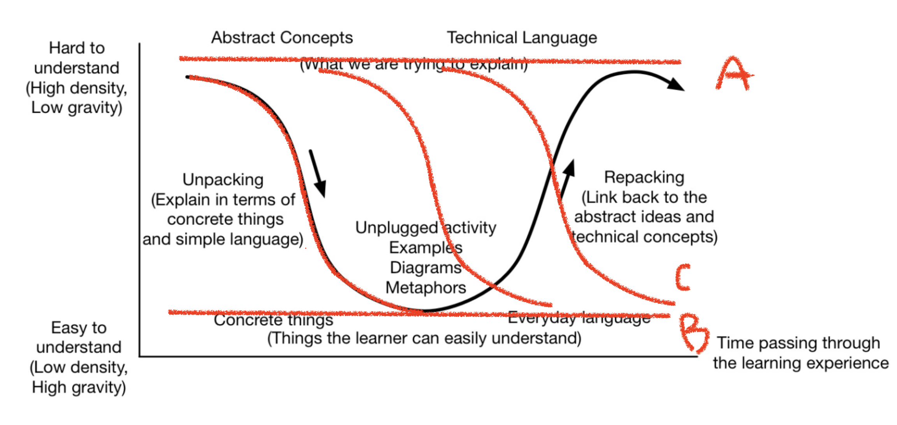

# Chapter 13. 새로운 개발자 팀원의 적응 지원
- 후배들이 더 효과적으로 학습할 수 있기 위해서는 그들이 경험하는 인지 부하를 관리해야 한다.
- 그들에게 제공하는 적응 지원을 개선하는 방법을 알아보자.

## 13.1 적응 지원의 문제
- 팀의 선임자들이 어려움을 겪는 이유 중 하나는 '전문가의 저주' 때문
  - 어떤 기술을 충분히 익히고 나면, 그 기술이나 지식을 배우는 것이 얼마나 어려웠는지 잊어 버린다.
  - 따라서 새 팀원이 동시에 처리할 수 있는 새로운 작업의 수를 과대평가

## 13.2 전문가와 초보자의 차이
전문가와 초보자는 매우 다른 방식으로 생각하고 행동한다.

1. 전문가의 뇌는 LTM에 관련 기억을 많이 저장하는데 이 저장된 기억을 작업 기억 공간이 필요로 할 때마다 가져온다.
2. 전문가는 코드 및 코드와 관련 있는 모든 사항, 즉 오류 메시지, 테스트 문제, 해결책 등을 매우 효과적으로 청킹할 수 있다.
### 초보자의 행동에 대한 심층적 이해
- 초보 프로그래머들의 행동을더 잘 이해하기 위해서, 신피아제주의neo-Piagetism이라는 심리학 프레임워크를 고려해보자.
  - 새로운 정보에 직면했을 때 사람들이 어떻게 행동하는지 설명

#### 피아제의 원래 모델
- 피아제의 인지 발달 단계 개요
  
  | 단계 | 특징 | 연령 |
  | ---  | ---- | ---- |
  | 감각 운동기 | 아이들은 계획이나 전략이 부족하다. 단순히 물건을 더듬어 잡는다. | 0~2세|
  | 전조작기 | 아이들은 가설과 계획을 형성하기 시작하지만 이것들을 사고할 때 안정적으로 사용하지 못한다. | 2~7세 |
  | 구체적 조작기 | 아이들은 자신들이 보는 구체적인 것에 대해 추론할 수 있으나 일반적인 결론을 끌어내기는 어렵다. | 7~11세 |
  | 형식적 조작기 | 형식적 추론이 가능하다. | 11세 이상 |

#### 프로그래밍에 적용한 신피아제주의이ㅡ 모델
- 사람들이 자바 프로그래밍과 같은 특정 도메인에서 형식적 조직기에 있으면서 동시에 파이썬 프로그래밍에서는 감각운동기 수준에 있을 수 있다.
- 심지어는 특정 코드베이스에 대해서는 형식적 조작기 단계에 있다가 새로운 코드베이스에서는 하위 단계로 떨어질 수 있다.
- 신피아제주의 개발 단계와 그에 상응하는 프로그래밍 동작 개요

    | 단계 | 특징 | 프로그래밍 행위 |
  | ---  | ---- | ---- |
  | 감각 운동기 | 아이들은 계획이나 전략이 부족하다. 단순히 물건을 더듬어 잡는다. | 프로그래머는 프로그램 실행에 대해 일관되지 못하게 이해한다. 프로그램을 정확하게 추적할 수 없다.|
  | 전조작기 | 아이들은 가설과 계획을 형성하기 시작하지만 이것들을 사고할 때 안정적으로 사용하지 못한다. | 프로그래머는 상태표 등을 만들어 여러 줄의 코드 결과를 수동적으로 예측할 수 있다. 이 단계의 프로그래머는 종종 코드의 일부가 무엇을 하는지 추측한다. |
  | 구체적 조작기 | 아이들은 자신들이 보는 구체적인 것에 대해 추론할 수 있으나 일반적인 결론을 끌어내기는 어렵다. | 프로그래머는 전조작기처럼 귀납적 접근법을 사용하기보다 코드 자체를 읽음으로써 코드에 대해 연역적으로 추론한다. |
  | 형식적 조작기 | 형식적 추론이 가능하다. | 프로그래머는 논리적이고 일관적이며 체계적으로 추론할 수 있다. 여기서의 추론은 자신의 행위를 뒤돌아보는 것을 포함하며, 이것은 디버깅에 필수적이다. |

- 세 번째 단계부터 프로그래머들은 제대로 된 프로그래머처럼 행동하기 시작

#### 새로운 정보를 학습하면 일시적으로 다른 것들을 잊어버릴 수 있다
- 코드의 추적 없이 파이썬 함수를 안정적으로 읽던 개발자가 *args를 사용하는 가변 매개변수 함수를 처음 접하게 되면 이런 함수를 어려움 없이 읽게 되기까지는 함수를 추적해야 할 수 있다.

### 개념을 구체적으로 보는 것과 추상적으로 보는 것의 차이
- 언어 또는 코드베이스의 초보자에게는 두 가지 형태의 설명이 효과적이다.
- 이상적으로는 초보자가 무언가를 이해하려 할 때, 의미적 파동semantic wave를 따른다.

  - 추상적으로 시작해서 구체적인 세부 사항을 통해 지식의 포장을 풀고 학습한 지식을 다시 LTM에 재포장

- 세 가지 안티 패턴 (주의!)
  
  
  - 고 평면선 (A) : 추상적인 용어만 사용
  - 저 평면선 (B) : 세부 사항을 지나치게 많이 설명
  - 하향 에스컬레이터 (C) : 의미적 파동을 따라 구체적인 것으로 내려가지만 구체적인 세부 사항 이해 후에 의미를 재포장할 여지를 남기지 않는 경우 (LTM에 통합할 시간을 주지 않는 경우)
- 새로운 개념과 예비 정보 사이에서 발견되는 공통점에 대해 초보자에게 명시적으로 물어보는 것이 재포장에 도움이 된다.

## 13.3 적응 지원 개선

### 작업은 하나의 프로그래밍 활동으로만 제한
- 적응 지원 과정의 문제 중 하나는 새 팀원에게 최소 네 가지 다른 활동을 수행하도록 요구한다는 점
- 이 활동들은 프로그래머와 시스템 모두에게 서로 다른 인지적 요구 사항을 부과한다.
- 적응 지원 기간에는 구체적으로 다섯 가지 범주 각각에 해당하는 활동을 선택하고 새 팀원에게 하나씩 시키는 것이 좋다.

| 활동 | 적응 지원 교육 대상자를 지원하기 위한 예시 |
| ---- | ---- |
| 탐구 | 코드 베이스의 전체적인 이해를 위한 코드 훑어보기 |
| 검색 | 특정 인터페이스를 구현한 클래스 찾기 |
| 전사 | 구현할 메서드에 대한 명확한 계획을 알려주기 |
| 이해 | 코드의 여러 측면에 대해 이해하기, 예를 들면 특정 메서드를 요약하기 |
| 증가 | 향후 계획을 포함해서 기존 클래스에 한 가지 기능을 추가하기 |

### 새 팀원의 기억 지원
> 공감과 인내는 중요하다.

#### LTM 지원 : 관련 정보 설명
- 코드베이스 작업 시 중요한 역할을 하는 관련 정보를 숙지해둠으로써 새로운 사용자를 위한 적응 지원 과정을 준비
- 새 팀원 도착 전 프로젝트를 종료한 팀에서 할 수 있다.
- ex. 코드에서 발생할 수 있는 모든 중요한 도메인 개념 문서화

#### STM 지원 : 규모가 작고 집중할 수 있는 작업 준비
- 새 팀원은 이미 STM에 과부하가 왔을 수 있음. 
- 따라서 적응 지원 과정을 여러 단계로 나누는 것이 좋다.

#### 작업 기억 공간 지원 : 도표 그리기
- 작업 기억 공간에 도움이 될 만한 테이블 만들기
- 완전 초보자들에게 도표가 항상 유용한 것은 아니니 주의

### 코드 함께 읽기
- 팀이 다 같이 코드를 읽으면 새 팀원의 인지 부하를 낮추고, 더 많은 작업 기억 공간을 갖고 코드에 집중할 수 있게 해준다.
- 활성화 - 관련된 것들을 적극적으로 생각해서 이미 가지고 있는 지식을 활성화
- 모니터링 - 텍스트를 읽으면서 자신이 이해한 것(그리고 이해하지 못하는 것까지)을 관찰하고 기록
- 중요도 결정 - 텍스트에서 어느 부분이 중요한지 결정
- 추론 - 텍스트에서 명시적으로 주어지지 않은 사실을 유추
- 시각화 - 깊이 있는 이해를 위해 텍스트에 대한 도표 만들기
- 질문 - 텍스트에 대해 질문
- 요약 - 텍스트를 짧게 요약

